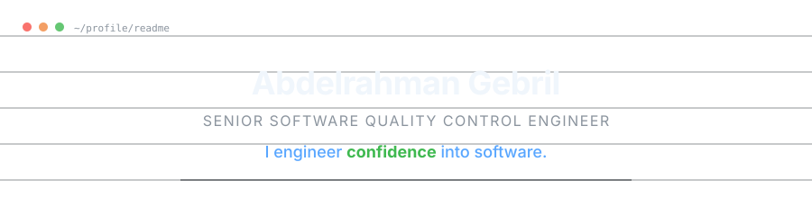

<picture>
  <source media="(prefers-color-scheme: dark)" srcset="assets/banner.svg">
  <source media="(prefers-color-scheme: light)" srcset="assets/banner.svg">
  
</picture>

 

---

### &nbsp;&nbsp;I engineer confidence into software.

I'm **Abdelrahman Gebril**, a Senior Software Quality Control Engineer and product builder based in Egypt. I turn complex workflows into reliable, polished systems that teams can trust.

Quality engineering is my foundation. I combine deep testing expertise with product engineering, infrastructure, and AI-assisted development to deliver complete solutions — not just test cases, but the platforms, automations, and guardrails that make quality visible and repeatable.

**Focus areas:**&nbsp; Web &nbsp;·&nbsp; Mobile &nbsp;·&nbsp; API &nbsp;·&nbsp; Quality Systems &nbsp;·&nbsp; Automation &nbsp;·&nbsp; AI-assisted engineering

---

## Featured Work

> Systems built around real workflows, not feature checklists.

<table>
<tr>
<td width="50%" valign="top">

### QC-Manager&nbsp;&nbsp; `FLAGSHIP`

Quality control and delivery management platform. A full-stack operations system that gives QA teams one place for test management, resource planning, release governance, role-based dashboards, notifications, and third-party integrations.

**Status:** In active development · Solo developer & architect

`Next.js 14` `TypeScript` `PostgreSQL` `Docker` `n8n` `Traefik` `Supabase` `Express`

</td>
<td width="50%" valign="top">

### Planora&nbsp;&nbsp; `COMPLETE`

Event agency management system. A polished, zero-build web application for inventory, clients, quotations, venues, KPIs, and event scheduling — designed for fast deployment and day-to-day agency operations.

`HTML5` `CSS3` `JavaScript` `Chart.js`

</td>
</tr>
<tr>
<td width="50%" valign="top">

### BankProject&nbsp;&nbsp; `AUTOMATION`

Banking workflow automation framework. A maintainable Selenium and pytest framework demonstrating page objects, reusable test data, and CI-ready coverage for core banking journeys.

`Python` `Selenium` `pytest`

</td>
<td width="50%" valign="top">

### Flutter Products&nbsp;&nbsp; `MOBILE`

A collection of mobile applications spanning event booking, daily remembrances, peer-to-peer trading, social connections, and personal finance.

`Flutter` `Dart` `Mobile UI`

</td>
</tr>
</table>

[Browse all repositories →](https://github.com/Gebrilo?tab=repositories)

---

## Quality Engineering Capabilities

Testing is the lens. Engineering, infrastructure, and product thinking are how I make the result last.

<table>
<tr>
<td width="33%">

**Test Strategy & Design**
Building test approaches that align with business risk, not just requirements coverage.

</td>
<td width="33%">

**Test Automation**
Playwright · Selenium · JUnit · TestNG · pytest — frameworks that scale across web, mobile, and API surfaces.

</td>
<td width="33%">

**Manual & Exploratory Testing**
Structured session-based testing and heuristic evaluation that finds what scripts miss.

</td>
</tr>
<tr>
<td width="33%">

**Web & API Testing**
End-to-end validation of frontend behavior, REST APIs, and integration points.

</td>
<td width="33%">

**Performance Testing**
JMeter · k6 · Netdata — load, stress, and monitoring to understand system behavior under pressure.

</td>
<td width="33%">

**Quality Governance**
Release readiness, quality gates, defect triage, and metrics that make quality a decision-making input.

</td>
</tr>
<tr>
<td width="33%">

**CI-Ready Testing**
Test suites designed to run in pipeline — fast feedback, clear failure signals, artifact-backed results.

</td>
<td width="33%">

**Workflow & Business-Rule Validation**
Testing that understands domain logic, not just UI interactions.

</td>
<td width="33%">

**Defect Management**
Root-cause analysis, reproduction, severity assessment, and fix verification.

</td>
</tr>
</table>

---

## Technology Stack

<table>
<tr>
<th align="left">Test Automation</th>
<th align="left">Product Engineering</th>
<th align="left">Web & Mobile</th>
</tr>
<tr>
<td>

</td>
<td>

</td>
<td>

</td>
</tr>
<tr>
<th align="left">Infrastructure & Data</th>
<th align="left">Performance & Monitoring</th>
<th align="left">Delivery & Collaboration</th>
</tr>
<tr>
<td>

</td>
<td>

</td>
<td>

</td>
</tr>
</table>

---

## What I'm Building & Exploring

- **AI-assisted quality workflows** — using generative AI and agents to accelerate test design, defect analysis, and quality decision-making
- **Quality management platforms** — building QC-Manager as a complete system for how QA teams actually operate
- **Test automation architecture** — frameworks that are maintainable, fast, and integrated into delivery pipelines
- **Workflow automation** — connecting tools and processes so quality data flows without manual handoffs
- **Practical AI in testing** — experimenting with how LLMs, retrieval systems, and agents can improve testing and product delivery

---

## GitHub Activity

<picture>
  <source media="(prefers-color-scheme: dark)" srcset="https://github-readme-stats.vercel.app/api?username=Gebrilo&show_icons=true&theme=github_dark&hide_border=true&bg_color=00000000&title_color=58a6ff&icon_color=3fb950&text_color=c9d1d9&ring_color=58a6ff&hide=stars&count_private=true&include_all_commits=true">
  <source media="(prefers-color-scheme: light)" srcset="https://github-readme-stats.vercel.app/api?username=Gebrilo&show_icons=true&theme=default&hide_border=true&bg_color=00000000&title_color=0969da&icon_color=1a7f37&text_color=434d58&ring_color=0969da&hide=stars&count_private=true&include_all_commits=true">
  
</picture>

<picture>
  <source media="(prefers-color-scheme: dark)" srcset="https://github-readme-stats.vercel.app/api/top-langs/?username=Gebrilo&layout=compact&theme=github_dark&hide_border=true&bg_color=00000000&title_color=58a6ff&text_color=c9d1d9&langs_count=6">
  <source media="(prefers-color-scheme: light)" srcset="https://github-readme-stats.vercel.app/api/top-langs/?username=Gebrilo&layout=compact&theme=default&hide_border=true&bg_color=00000000&title_color=0969da&text_color=434d58&langs_count=6">
  
</picture>

---

## Let's Collaborate

I'm interested in discussing and working on:

- Quality engineering platforms and internal tools
- Test automation architecture and strategy
- AI-assisted testing and QA workflow optimization
- Product quality and release-governance systems
- Building complete systems around operational workflows

If you're working on something that makes software quality more visible, measurable, or reliable — I'd like to hear about it.

---

 

---

*Quality isn't found. It's engineered.*

